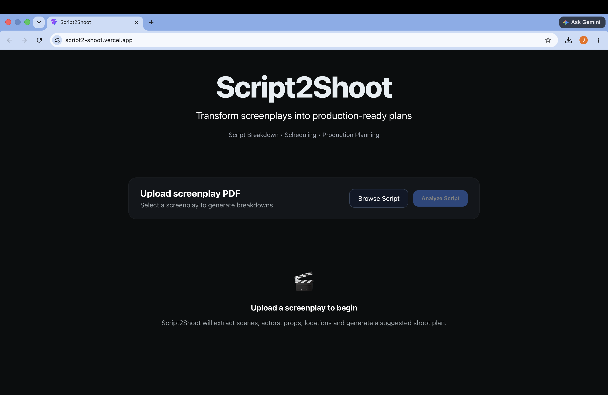

# Script2Shoot

## Overview

Script2Shoot is an AI-powered production planning assistant designed for Assistant Directors, Line Producers, and Filmmakers.

The application analyzes screenplay PDFs and automatically generates production-ready breakdowns, including scenes, actors, locations, props, special requirements, shoot planning recommendations, and downloadable production reports.

Script2Shoot helps production teams reduce manual screenplay breakdown time from hours to minutes.

---

## Live Application

https://script2-shoot.vercel.app/

---

## Features

* Screenplay PDF Upload
* AI-Powered Scene Extraction
* Actor Breakdown
* Location Breakdown
* Props Breakdown
* Production Requirements Detection
* Scene Complexity Analysis
* Location-Based Shoot Planning
* PDF Production Report Export

---

## Architecture Overview

Frontend:

* React
* Vite
* Axios

Backend:

* Node.js
* Express
* Multer
* PDF Parsing Services

AI Layer:

* Azure OpenAI
* GPT-4.1 Mini

Workflow:

Screenplay PDF
→ Text Extraction
→ GPT Analysis
→ Structured JSON
→ Production Breakdown
→ Shoot Planning
→ PDF Report Generation

---

## AI Tools Used

### Azure OpenAI

Model:

* GPT-4.1 Mini

AI Responsibilities:

* Scene Extraction
* Actor Identification
* Props Detection
* Location Detection
* Costume Detection
* Production Requirement Detection
* Complexity Assessment
* Shoot Plan Generation Support

Prompt engineering was used to convert screenplay text into structured production planning data.

---

## Dependencies

Frontend:

* React
* Vite
* Axios

Backend:

* Express
* OpenAI SDK
* Multer
* PDFKit
* PDF Parsing Libraries

Deployment:

* Vercel
* Render

---

## Setup Instructions

### Backend

```bash
cd backend

npm install

npm start
```

Create a `.env` file:

```env
AZURE_OPENAI_ENDPOINT=YOUR_ENDPOINT
AZURE_OPENAI_API_KEY=YOUR_KEY
AZURE_OPENAI_DEPLOYMENT=YOUR_DEPLOYMENT
```

### Frontend

```bash
cd frontend

npm install

npm run dev
```

Create a `.env` file:

```env
VITE_API_URL=http://localhost:3001
```

---

## Team

### Jerome Benedict

---

## Screenshots

A complete gallery of application screenshots is available in the `docs/screenshots` folder.

Preview:




---

## Future Enhancements

* Full Screenplay Chunking
* Advanced Scheduling Optimization
* Budget Estimation
* Crew Planning
* Call Sheet Generation
* Multi-Script Project Management